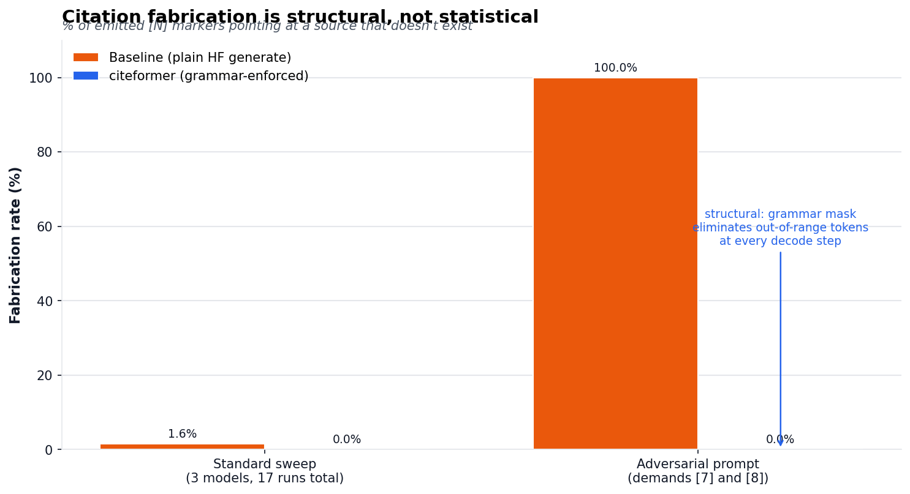
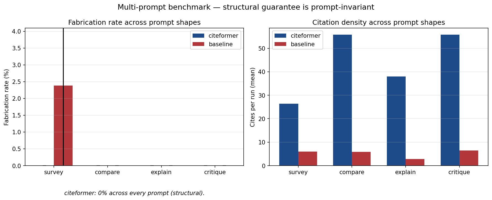

# citeformer

[](https://pypi.org/project/citeformer/)
[](https://citeformer.readthedocs.io)
[](LICENSE)
[](https://pypi.org/project/citeformer/)
[](https://github.com/random-walks/citeformer/actions/workflows/ci.yml)

***A bulletproof way to generate verifiably cited text from language models.***



> **Status**: pre-1.0 on `feat/p0-scaffolding`; v0.1 tag is imminent. Ships five backends (HF + vLLM + llama.cpp local, OpenAI + Anthropic API), six hand-written CSL styles, deterministic bibliography rendering, and claim-level NLI verification. Follow [CHANGELOG.md](CHANGELOG.md) for the full change log.

## Why citeformer

LLM-generated citations are wrong 14–95% of the time depending on the benchmark. RAG systems still fabricate 3–13% of cited URLs. NeurIPS 2025 accepted ~50 papers with AI-generated fake references. Prompting doesn't fix it; post-hoc verification doesn't fix it. The only real fix is **structural** — make the invalid output token-impossible before the model reaches the decision point.

That's the [jsonformer](https://github.com/1rgs/jsonformer) insight applied to citations. citeformer wraps modern constrained-decoding libraries ([XGrammar](https://github.com/mlc-ai/xgrammar), [llguidance](https://github.com/guidance-ai/llguidance)) and six hand-written CSL formatters (APA 7, MLA 9, Chicago author-date, IEEE, Nature, Vancouver — see [ADR-004](docs/decisions/004-citeproc-rewrite.md)) into a single API where:

- **Citation markers can't be fabricated.** `[N]` where `N > len(sources)` is token-impossible to sample on local backends, and schema-rejected on OpenAI. Proven across [24 multi-prompt runs](benchmarks/README.md#finding-5--multi-prompt-sweep-structural-guarantee-is-prompt-invariant) — **0% fabrication on every prompt × model × seed triple**.
- **Bibliographies are rendered by the library, not the model.** Six styles, deterministic output, [300 locked snapshots](tests/unit/test_csl_suite/).
- **Every citation is claim-verifiable.** `result.verify()` runs NLI entailment per cite and returns a structured `VerificationReport` — not just a hit rate.

## Install

```bash
# Core only — no model backend, just the types + rendering + metadata adapters.
pip install citeformer

# Local backends (logit-tier enforcement).
pip install 'citeformer[hf]'             # HuggingFace transformers + XGrammar
pip install 'citeformer[llamacpp]'       # llama.cpp native GBNF
pip install 'citeformer[vllm]'           # vLLM guided-decoding (Linux/CUDA only)

# API backends (schema-tier enforcement).
pip install 'citeformer[openai]'         # Structured Outputs strict=true
pip install 'citeformer[anthropic]'      # Citations API adapter

# NLI verification (DeBERTa-v3-MNLI).
pip install 'citeformer[verify]'

# Cross-platform kitchen sink (HF + llama.cpp + verify; excludes vLLM).
pip install 'citeformer[all]'
```

Python 3.11+ (tested through 3.14). Apache-2.0.

**Try it without installing.** The [HF Space demo](hf-space/) runs the adversarial "100% → 0% fabrication" swing on CPU in your browser. The [literature-review notebook](examples/08_literature_review.ipynb) walks end-to-end from arXiv fetch → grammar-constrained generation → NLI verification → APA-7 bibliography on a laptop-friendly 500 MB model.

## Quickstart

```python
from citeformer import Citeformer, Policy, Source
from citeformer.backends.hf import HFBackend

sources = [
    Source.from_doi("10.1038/s41586-023-06221-2"),
    Source.from_arxiv("2305.14627"),
    Source(
        metadata={
            "id": "poe-raven",
            "type": "book",
            "title": "The Raven",
            "author": [{"family": "Poe", "given": "Edgar Allan"}],
            "issued": {"date-parts": [[1845]]},
        },
        content="Once upon a midnight dreary...",
    ),
]

cf = Citeformer(
    backend=HFBackend(model="microsoft/Phi-3.5-mini-instruct"),
    style="apa-7",
    citation_policy=Policy.REQUIRED,
)
result = cf.generate(prompt="Summarize the three works.", sources=sources)

print(result.text)               # "Poe's The Raven opens... [3] BERT introduced... [2]"
for ref in result.references:
    print(ref.rendered)          # APA-7, rendered by the formatter — not the LLM

report = result.verify()         # NLI entailment per citation
print(f"{report.support_rate:.0%} of cites entailed by their source")
```

`result.text` cannot contain `[4]`. Not "unlikely to"; *cannot*, by grammar construction. Try more backends, styles, or the API tier with `from citeformer.backends.openai import OpenAIBackend` / `anthropic import AnthropicBackend`.

## Backends

Five backends, two enforcement tiers, one `Backend` ABC:

| Backend            | Extra      | Enforcement tier   | Where it lives               | Notes |
|--------------------|------------|--------------------|------------------------------|-------|
| `HFBackend`        | `hf`       | **Logit (XGrammar)** | `citeformer.backends.hf`    | Flagship. Grammar-level token masking. |
| `LlamaCppBackend`  | `llamacpp` | **Logit (GBNF)**     | `citeformer.backends.llamacpp` | Native GBNF via `llama-cpp-python`. CPU + Metal + CUDA. |
| `VLLMBackend`      | `vllm`     | **Logit (XGrammar/llguidance)** | `citeformer.backends.vllm` | vLLM guided decoding. Linux/CUDA only. |
| `OpenAIBackend`    | `openai`   | **Schema (strict JSON)** | `citeformer.backends.openai` | OpenAI Structured Outputs with `enum`-bounded cite ids. |
| `AnthropicBackend` | `anthropic`| **Provider-native** | `citeformer.backends.anthropic` | Adapter over Anthropic's Citations API. |
| `MockBackend`      | (core)     | Scripted             | `citeformer.backends.mock`  | For tests. Honors policies + marker styles. |

All five produce the same `GenerationResult`, so verify / render / streaming work identically across tiers. Full tier discussion: [architecture.md](docs/reference/architecture.md#tiered-enforcement--local-vs-api).

## Citation policies

`Policy` controls where citations are grammatically required:

| Policy        | Shape of valid output | When to use |
|---------------|-----------------------|-------------|
| `REQUIRED`    | Every sentence ends `content cite-group sent-end`. Cite or can't close. | Literature reviews, survey papers, anything where every claim needs provenance. |
| `QUOTES_ONLY` | Only `"..."` quoted spans require a trailing `cite-group`. | Mixed analytical prose — narrative is uncited, direct quotations are tracked. |
| `AUTO`        | `cite-group` is allowed anywhere, never required. `verify()` flags uncited-but-entailed sentences post-hoc. | Open-ended generation; NLI coverage check does the policing. |

Pass via `Citeformer(citation_policy=Policy.REQUIRED)` or per-call `cf.generate(..., policy=Policy.AUTO)`. See [`Policy`](src/citeformer/core.py).

## Metadata adapters

Build `Source` objects from real-world inputs:

```python
Source.from_doi("10.1038/s41586-023-06221-2")      # Crossref → CSL-JSON
Source.from_arxiv("2305.14627")                     # arXiv API → CSL-JSON + abstract
Source.from_pdf("paper.pdf")                        # pypdf → title + body text
Source.from_url("https://example.com/article")      # readability-lxml + OpenGraph

# Bulk-load a library; each returns list[Source].
Source.from_bibtex("refs.bib")                      # BibTeX parser → CSL-JSON
Source.from_zotero("zotero-export.json")            # Zotero CSL JSON / Better BibTeX
```

All fetchers are cached on disk via `diskcache` (`~/.cache/citeformer/metadata/`, override with `CITEFORMER_CACHE_DIR`).

## Inline marker shapes

`[N]` collides with Markdown link syntax. Switch it out with `MarkerStyle`:

```python
from citeformer import MarkerStyle

cf = Citeformer(backend=backend, marker_style=MarkerStyle.PAREN)    # (1), (2) ...
cf = Citeformer(backend=backend, marker_style=MarkerStyle.CURLY)    # {1}, {2} ...
cf = Citeformer(backend=backend, marker_style=MarkerStyle.CARET)    # ^1, ^2 ...
```

The structural guarantee is identical across styles — the grammar's digit enum is bounded by `range(1, len(sources) + 1)` regardless of which delimiters surround it. See [ADR-011](docs/decisions/011-configurable-marker-styles.md).

## Streaming

```python
stream = cf.stream(prompt="...", sources=sources)
for chunk in stream:
    print(chunk, end="", flush=True)
result = stream.finalize()    # full GenerationResult with parsed citations + refs
```

Grammar constraints apply to every chunk. HF and llama.cpp deliver true token-by-token streaming; the API backends chunk on sentence boundaries for UI progression.

## Evidence

All numbers below come from running scripts in [`benchmarks/`](benchmarks/) — reproducible on a commodity laptop with `uv run python -m benchmarks.<script>`.



| Finding | Result | Script |
|---------|--------|--------|
| [Adversarial](benchmarks/README.md#finding-1--adversarial-100--0-fabrication) | 100% → 0% fabrication swing when the prompt demands out-of-scope ids | `adversarial.py` |
| [Sweep](benchmarks/README.md#finding-2--sweep-aggregate-0--0-fabrication-across-all-models) | 0 ± 0 fabrication across 13 runs (3 models × up to 5 seeds) | `sweep.py` |
| [Full-text premise](benchmarks/README.md#finding-3--full-text-nli-premise-lifts-support-substantially-but-noisily) | Support rate lifts with full-text NLI premise — but the number is noisy, so we report that honestly | `sweep.py --premise fulltext` |
| [NLI calibration](benchmarks/README.md#finding-4--nli-threshold-calibration-deberta-v3-large-is-bimodal) | DeBERTa-v3-large is bimodal; threshold isn't the right knob | `threshold_calibration.py` |
| [Multi-prompt](benchmarks/README.md#finding-5--multi-prompt-sweep-structural-guarantee-is-prompt-invariant) | 0% fab across 24 runs × 4 prompt shapes — guarantee is prompt-invariant | `multiprompt_sweep.py` |

## Composition, not reinvention

citeformer's value is the **composition**, not the parts. The heavy lifting lives in established dependencies:

| We piggyback on | For |
|---|---|
| **XGrammar** / **llguidance** | Token-level logit masking at generation time |
| **transformers** / **vLLM** / **llama-cpp-python** | Running local models |
| **openai** / **anthropic** SDKs | API-provider generation |
| **lark** | Authoring citation grammars before hand-off to the decoder |
| **pydantic** | Immutable output schemas with `extra="forbid"` |
| **httpx** + **diskcache** | Metadata fetchers (Crossref, arXiv) with caching |
| **pypdf** | PDF text extraction |
| **readability-lxml** | URL extraction |
| **DeBERTa-v3-MNLI** (via transformers) | NLI entailment for `verify()` |
| **typer** + **rich** | CLI + pretty output |

The parts citeformer owns: citation grammar shape ([§10.1](docs/reference/contracts.md)), CSL-JSON source contract ([§10.2](docs/reference/contracts.md)), output pydantic models ([§10.3](docs/reference/contracts.md)), marker-to-reference coupling, the six bundled style formatters (APA 7, MLA 9, Chicago author-date, IEEE, Nature, Vancouver — [ADR-004](docs/decisions/004-citeproc-rewrite.md)), the BibTeX parser, and the orchestration loop. Everything else is a composition.

## Examples

The [`examples/`](examples/) directory contains eight runnable scripts, each a living report:

| # | File | What it shows |
|---|------|---------------|
| 1 | [`01_quickstart_mock.py`](examples/01_quickstart_mock.py) | Shortest possible demo — no ML, no extras |
| 2 | [`02_rag_with_hf_and_verify.py`](examples/02_rag_with_hf_and_verify.py) | Full RAG pipeline with HF + NLI verify |
| 3 | [`03_standalone_rendering.py`](examples/03_standalone_rendering.py) | All six styles on the same CSL-JSON item |
| 4 | [`04_fetch_and_render.py`](examples/04_fetch_and_render.py) | DOI → Crossref → rendered reference |
| 5 | [`05_streaming.py`](examples/05_streaming.py) | Realtime chunk streaming via `cf.stream()` |
| 6 | [`06_langchain_rag.py`](examples/06_langchain_rag.py) | LangChain `Document` → `Source` → citeformer |
| 7 | [`07_llamaindex_rag.py`](examples/07_llamaindex_rag.py) | LlamaIndex `NodeWithScore` → `Source` |
| 8 | [`08_literature_review.ipynb`](examples/08_literature_review.ipynb) | Full academic workflow notebook (arXiv → review → verify → APA-7) |

## Is this for you?

**Probably yes if:**

- You're building RAG and need citations that can't hallucinate.
- You run open-weight models locally (HF / vLLM / llama.cpp) and want grammar-level guarantees.
- You call an API (OpenAI / Anthropic) and want the same `GenerationResult` / `Citation` / `Reference` surface across your providers.
- You need APA / MLA / Chicago / IEEE / Nature / Vancouver bibliographies rendered deterministically.
- You care about claim-level NLI verification out of the box.
- You want to ingest from BibTeX / Zotero / DOI / arXiv / PDF / URL without glue code.

**Probably no if:**

- You want a full agent framework — use LangChain / LlamaIndex and compose citeformer as the generation step ([examples 6 & 7](#examples) show how).
- You need a TypeScript surface today — a sibling `citeformer-ts` may come later; not here yet.
- You need a citation style outside the six bundled — you can plug in `citeproc-py` yourself, or contribute a `CitationFormatter` subclass (see [`.claude/skills/add-citation-format`](.claude/skills/add-citation-format/)).

## Documentation

- **Getting started**: [getting-started](https://citeformer.readthedocs.io/en/stable/getting-started.html)
- **Guarantees**: [guarantees](https://citeformer.readthedocs.io/en/stable/guarantees.html) — what "bulletproof" actually covers.
- **Architecture**: [reference/architecture](https://citeformer.readthedocs.io/en/stable/reference/architecture.html) — layers + phase plan + tiered enforcement.
- **Contracts**: [reference/contracts](https://citeformer.readthedocs.io/en/stable/reference/contracts.html) — the three §10 invariants.
- **ADRs**: [docs/decisions/](docs/decisions/) — 11 short architecture-decision records documenting major design choices.
- **Benchmarks**: [benchmarks/README.md](benchmarks/README.md) — the five findings with reproduction commands.

## Contributing

See [CONTRIBUTING.md](CONTRIBUTING.md). Short version: bug-fix PRs welcome and bump patch; feature PRs should open an issue first. The three §10 contracts (grammar shape, CSL metadata, output schemas) are deliberate ceremonies — read [docs/reference/contracts.md](docs/reference/contracts.md) before touching them.

## License

Apache-2.0. See [LICENSE](LICENSE).
