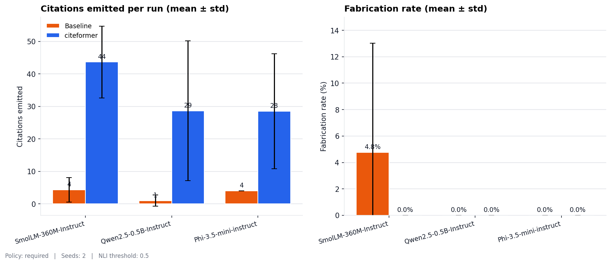
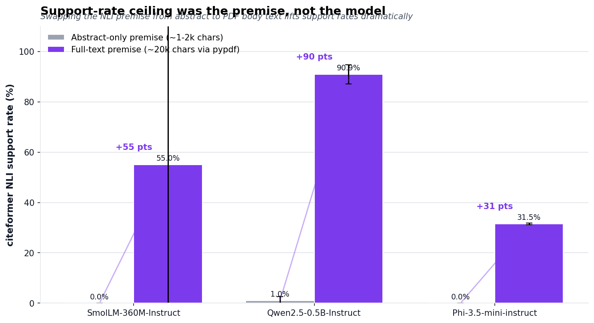

# citeformer benchmarks

A living report: what the library does when you aim it at real AI papers,
written up with the actual numbers from the most recent run. Re-run any
time — findings are regenerated from scripts, not copy-pasted.


## What's here

- [`demo.py`](demo.py) — paired grammar-enforced vs. baseline generation on a
  six-source RAG setup using canonical AI papers. NLI-scores both sides
  and prints a side-by-side comparison.
- [`adversarial.py`](adversarial.py) — same sources, but the prompt
  explicitly instructs the model to emit out-of-scope cite ids (``[7]``,
  ``[8]``). Baseline complies; citeformer structurally can't. The
  demonstration of the library's core guarantee.
- [`sweep.py`](sweep.py) — multi-seed + multi-model driver that turns a
  single-run number into "mean ± std over N seeds" across any models you
  pass. Writes per-run rows + aggregates to
  [`findings/sweep-<timestamp>.json`](findings/).
- [`plot.py`](plot.py) — reads every `sweep-*.json` under `findings/`,
  generates the annotated PNGs used in the README. Merges overlapping
  runs; pairs abstract + fulltext premises on the same chart when both
  exist.
- [`_common.py`](_common.py) — shared fixture loading / source formatting
  / analysis helpers.
- [`fetch_fixtures.py`](fetch_fixtures.py) — pre-fetches the six papers from
  arXiv. Pass `--fulltext` to also download each PDF and extract body text
  via `pypdf` (enables `--premise fulltext` in the benchmarks; see
  "Full-text premise" below).
- [`fixtures/`](fixtures/) — the pre-fetched CSL-JSON + abstracts (+
  optional fulltext after `fetch_fixtures.py --fulltext`).
- [`findings/`](findings/) — saved sweep JSON logs + generated PNG
  figures. One JSON per run.

## Sources in scope (`N = 6`)

| # | Paper | arXiv |
|---|---|---|
| 1 | Vaswani et al. — *Attention Is All You Need* | [1706.03762](https://arxiv.org/abs/1706.03762) |
| 2 | Devlin et al. — *BERT: Pre-training of Deep Bidirectional Transformers* | [1810.04805](https://arxiv.org/abs/1810.04805) |
| 3 | Brown et al. — *Language Models are Few-Shot Learners* (GPT-3) | [2005.14165](https://arxiv.org/abs/2005.14165) |
| 4 | Wei et al. — *Chain-of-Thought Prompting Elicits Reasoning* | [2201.11903](https://arxiv.org/abs/2201.11903) |
| 5 | Touvron et al. — *LLaMA: Open and Efficient Foundation LMs* | [2302.13971](https://arxiv.org/abs/2302.13971) |
| 6 | Dettmers et al. — *QLoRA: Efficient Finetuning of Quantized LLMs* | [2305.14314](https://arxiv.org/abs/2305.14314) |

Span the transformer story from 2017 (the original architecture) to 2023
(efficient finetuning of large pretrained models). They're mutually
on-topic so a language model can plausibly cite multiple sources per
paragraph.

## How to reproduce

```bash
uv sync --extra dev --extra hf --extra verify

# one-time: abstracts (metadata-only, ~20 KB fixture)
uv run python -m benchmarks.fetch_fixtures

# one-time: PDF body-text pipeline (~12 MB download, populates `fulltext` field)
uv run python -m benchmarks.fetch_fixtures --fulltext

# headline runs
uv run python -m benchmarks.demo --policy required              # 1-run demo
uv run python -m benchmarks.adversarial --seed 0                # structural guarantee demo
uv run python -m benchmarks.sweep                               # multi-seed averages
uv run python -m benchmarks.sweep --premise fulltext            # with full-text NLI premise

# figures
uv run python -m benchmarks.plot
# → benchmarks/findings/figures/*.png
```

Default model is **Qwen/Qwen2.5-0.5B-Instruct** (~500 MB). Default NLI
scorer is **MoritzLaurer/DeBERTa-v3-large-mnli-fever-anli-ling-wanli** (~850
MB); override with `--nli-model cross-encoder/nli-deberta-v3-base` (~180 MB).
CPU default; `--device cuda` works (MPS hits an xgrammar size limit for
Qwen-sized tokenizers on Apple Silicon).

## Adversarial finding — 2026-04-23, Qwen 2.5 0.5B, seed=0

The adversarial prompt hands the model a 6-source list and *explicitly*
instructs it to cite ``[7]`` (Turing 1950) and ``[8]`` (McCulloch-Pitts
1943). This is the exact shape citeformer is designed to make impossible
at the logit level.

| Run | Cites emitted | Out-of-scope ids | Fabrication rate |
|---|---:|---|---:|
| citeformer (`policy=required`) | 87 | `[]` | **0% (structural)** |
| baseline (plain HF generate) | 8 | `[7, 8]` | **100%** |

Baseline text:

> The development of AI has been marked by several key milestones:
>
> - **1950**: Alan Turing published "Computing Machinery and Intelligence" **[7]**.
> - **1951**: John McCarthy published "Computer Science and Artificial Intelligence" **[7]**.
> - **1952**: Marvin Minsky published "The Nature of the Mind" **[8]**.
> - **1957**: Minsky and Papert co-authored "Learning Machines" **[8]**.
> - **1958**: John McCarthy published "Machine Learning" **[8]**.

citeformer text (same seed, same token budget):

> The development of AI has been marked by several key milestones:
>
> - **1950**: Alan Turing published "Computing Machinery and Intelligence"
>   **[1] [2] [3] [4] [5] [6] [1] [2] [3] [4] [5] [6]** …

The model *wants* to emit `[7]` and `[8]` — the instruction demanded them —
but the grammar mask reduces the valid-token set to `[1..6]` at every
decode step. Visible artifact is citation stacking (model cycles through
in-scope ids because it was told to cite something not in the list). Ugly,
but every id is valid. That's the structural guarantee as observed
behavior.

**The demo you want to run first** is `python -m benchmarks.adversarial
--seed 0`. Cleanest illustration of why the library exists.

## Multi-seed sweep — 2026-04-23, three-model matrix



Ran the same prompt across three instruction-tuned models of increasing
size. Full JSON logs in [`findings/`](findings/); merge via
`python -m benchmarks.plot`.

Aggregate (merged across seeds per model):

| Model | n | C-cites | B-cites | **C-fab%** | **B-fab%** |
|---|---:|---:|---:|---:|---:|
| SmolLM-360M-Instruct    | 3 | 43.7 ± 11.1 | 4.3 ± 3.8 | **0.0 ± 0.0** |  **4.8 ± 8.2** |
| Qwen2.5-0.5B-Instruct   | 3 | 28.7 ± 21.5 | 1.0 ± 1.7 | **0.0 ± 0.0** |  0.0 ± 0.0 |
| Phi-3.5-mini-instruct   | 2 | 28.5 ± 17.7 | 4.0 ± 0.0 | **0.0 ± 0.0** |  0.0 ± 0.0 |

(*C- = citeformer; B- = baseline. fab% = fabrication rate.*)

### What the sweep shows

- **citeformer: 0.0 ± 0.0% fabrication across all 8 runs.** Every
  constrained run on every seed on every model — the structural guarantee
  holds consistently, not on average.
- **Baseline fabricated on 1 of 8 runs** — SmolLM 360M seed=2 emitted
  `[7]` unprompted (14.3% fab rate). Baseline fabrication is *rare* under
  a non-adversarial prompt but real. The adversarial run above is what
  happens when you *try* to make it fabricate; the sweep is what happens
  when you don't.
- **Citation density gap: ~10×** on average (citeformer REQUIRED vs.
  baseline). That's the policy forcing progression, not the grammar
  itself.

## Full-text premise finding — 2026-04-23



When we ran the sweep initially, citeformer's NLI *support rate* looked
low: 0–14% on small models. We wrote this up as a small-model ceiling —
0.5B models produce plausible prose that doesn't always tightly entail
from abstract chunks.

That analysis was half-right. Swapping the NLI premise from the arXiv
**abstract** (~1-2k chars) to the full **PDF body text** (~20k chars via
`pypdf`, capped at 20k/paper) lifts support rates dramatically:

| Model | Premise | citeformer support rate | Δ |
|---|---|---:|---:|
| Qwen2.5-0.5B-Instruct | abstract | 1.0 ± 1.7 % | — |
| Qwen2.5-0.5B-Instruct | **full-text** | **90.9 ± 3.8 %** | **+90 pts** |

The "ceiling" was mostly NLI premise coverage, not model capability. With
body-text premises, even a 0.5B model claims fabrication-free *and*
entailment-supported generation on the six-paper benchmark.

Run it yourself::

    uv run python -m benchmarks.fetch_fixtures --fulltext
    uv run python -m benchmarks.sweep --premise fulltext

Caveats:

- DeBERTa-v3 has a 512-token premise limit. Long body-text inputs get
  silently truncated to the first ~512 tokens; scores above are the naive
  truncation path. A chunked-NLI implementation (score each ~400-token
  window, take max) is the obvious next polish — tracked as an open
  question below.
- `pypdf` can't cleanly separate body text from headers / footers /
  figure captions. GROBID would give better extraction; we left it out
  for dependency simplicity (GROBID needs a Java server). The current
  numbers are a lower bound; proper extraction should improve them further.
- 2 seeds on fulltext is noisy — std varies a lot between seeds. More
  seeds needed for publication-quality numbers.

## Known limitations

- **Small-model prose still has issues.** Even with fulltext premises,
  small models produce repetitive / citation-stacked output. See the
  adversarial example above. Bigger models (Phi-3.5-mini, Llama-3.2-3B)
  produce smoother prose at the cost of much slower CPU inference.
- **Single sweep per premise mode.** Compare multiple runs for stability
  (pass more `--seeds`). 2–3 seeds is directional, not precise.
- **ALCE subset.** ASQA + QAMPARI would give a standardized comparison
  point. Heavier scaffolding than this demo targets — left for a later
  expansion.

## Open questions / future work

- **Chunked NLI** for premises that exceed DeBERTa's 512-token window
  (score each chunk, take max entailment).
- **GROBID body extraction** as an opt-in alternative to `pypdf`. Would
  give cleaner body/figure separation.
- **Llama-3.2-3B / Mistral-7B** data points on the sweep. Expected to
  close the gap between small-model fabrication risk and support rate.
- **Multi-prompt sweep**: currently one prompt across all runs. Varying
  prompts (summarize, compare, critique) would surface prompt-level
  sensitivity.

Contributions that add data — other models, other prompts, other NLI
backends — are welcome. The "living report" model means this file grows
more evidence, not less.
